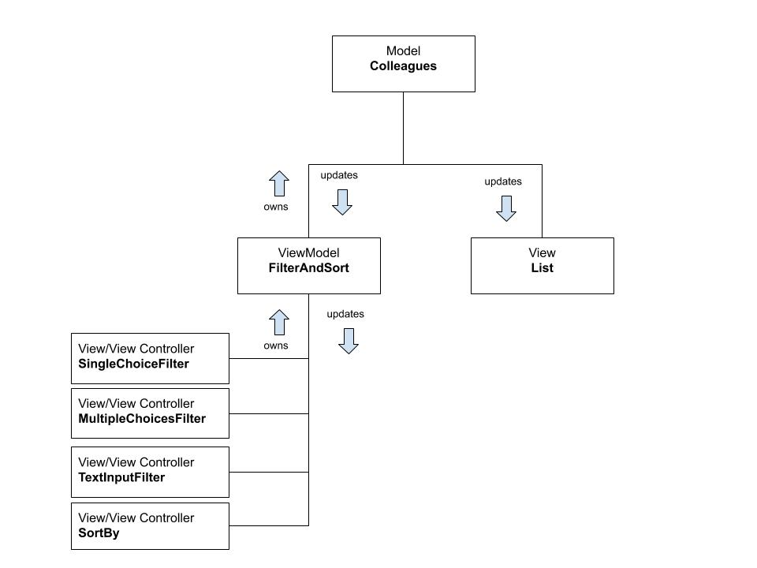

# Sprint

- 2pt [UX] Responsive design
- 1pt [UX] Fancy animations
- 1pt [FUNCT] Sort by name and office
- 1pt [FUNCT] Filter by name and office
- 1pt [FUNCT] Filter by contact links
- 2pt [FUNCT] Infinity scroll
- 2pt [TEST] Unit tests

**10 points in total**

## Why did i choose the features i did?

- _Unit tests_: It is important to have testing included, it is an easy way of decreasing the number of issues.
- _Infinity scroll_: Due to performance issues loading 200 images at once.
- _Sort and filtering functionality_: To increase the level of complexity in the application.
- _Responsive design_: Smaller devices are often used and should be supported.
- _Fancy animations_: Preloaders for the whole app and the profile images, because it gives a nice feeling to it. It makes the app feel thought through and it makes it ok to wait a little longer when loading the content.

# Design

I have gone for a separation between model and view, not a technically correct MVC but more like a MVVM.

### View & View Controller

There are some some interactive views in the filter area:

- The text input
- The single choice buttons (booleans), aka the social media buttons.
- The multiple choice buttons (office)
- The sort drop down

A view for each functionality. They are all just collecting user input for their parent, the FilterAndSort(**ViewModel**). Each filter input owns the **ViewModel** where they have a state for their own.

Then we have the main view, the list of colleagues. The main view only shows the list that it is provided with. The list is not interactive, and it is easily replaced with a new view, like for example in the task "Enable switch between a grid and a different view".

### ViewModel

**FilterAndSort**
The FilterAndSort has a state for the whole filter as well as the sort setup. It has the rules and logic for how the model is manipulated.
It owns a reference to its parent, the Colleagues component, which is the **Model**.
The filter and sort components (children) each updates the state of FilterAndSort, which is not only reflected in the components themselves but also in the **Model** Colleagues. Colleagues then updates the **main View** which is the List component.

### Model

**Colleagues**
The Colleagues component is the **Model** it has the state, the array of colleagues. It provides the FilterAndSort (ViewModel) with functionality for updating the model.

### Main View

The List component, wrapped in a infinity scroll component, is the main **View**. The main view is not interactive, it only shows what it is provided. It is easily replaced, it has no business logic.

# Way of working

I use some Semantics for Commit Messages in order to provide more information about the commit. Such as: feat, fix, style, chore, etc.

I work with feature branching meaning:

- I chose a feature to do
- I branch out from master
- I implement feature with tests
- I merge into master (usually verified by testers and developers)
- Then i do the same for the next feature.

I also setup the test script to run on commits with husky so that i don't commit anything that is not working.

In this project i use React with Styled Components in order to decrease the use of CSS/LESS files. I think it gives a better overview of what is included and what is happening. There is less searching for the place to be when adding styling.

---

This project was bootstrapped with [Create React App](https://github.com/facebook/create-react-app).

# Installation

Download the project and run yarn to install.

## Available Scripts

In the project directory, you can run:

### `yarn start`

Runs the app in the development mode. 
Open [http://localhost:3000](http://localhost:3000) to view it in the browser.

### `yarn test`

Launches the test runner in the interactive watch mode. 

### `yarn build`

Builds the app for production to the `build` folder. 
It correctly bundles React in production mode and optimizes the build for the best performance.

The build is minified and the filenames include the hashes. 
Your app is ready to be deployed!

See the section about [deployment](https://facebook.github.io/create-react-app/docs/deployment) for more information.
